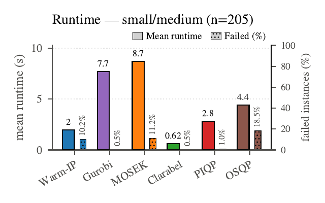
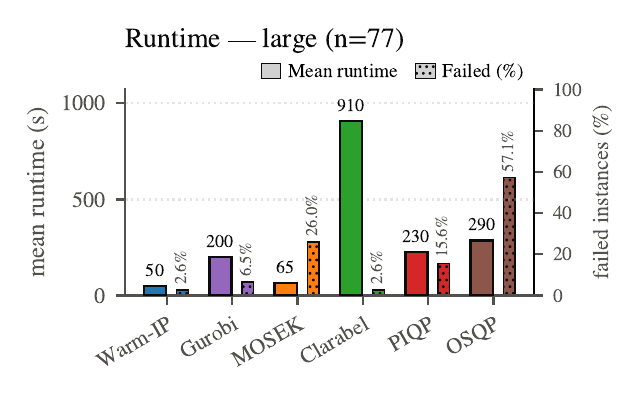
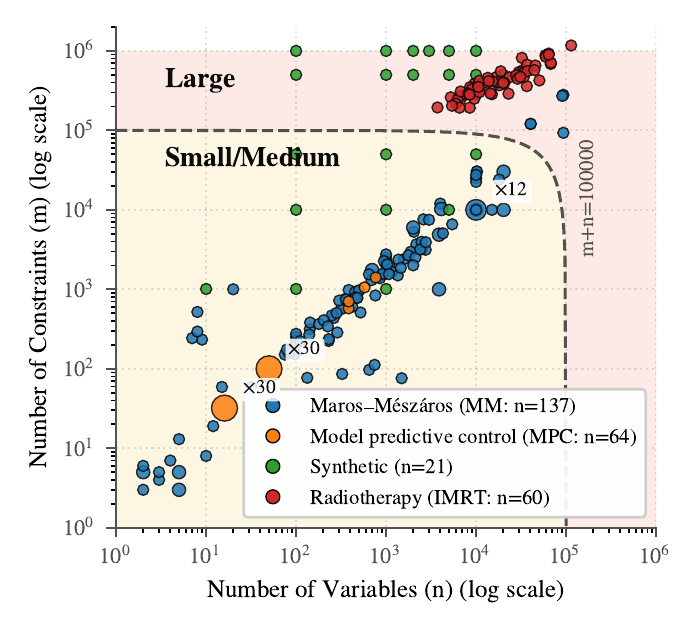

# Warm-IP: A Path-Following ADMM Warm Start for Interior-Point Quadratic Programming

Babak Aslani, Mojtaba Tefagh, Gourav Jhanwar, Masoud Zarepisheh

**Warm-IP** is an open-source solver for convex quadratic programs (QPs),
designed for **large-scale problems**. In benchmarks on 282 QPs spanning
model-predictive control, synthetic problems, the Maros-Meszaros test
set, and radiotherapy treatment planning — compared against leading
commercial and open-source solvers — Warm-IP is highly competitive on
large-scale instances: it is the fastest solver on the largest fraction
of the large problems, and on the radiotherapy benchmark (QPs with up to
roughly 900,000 constraints) it solves every instance and has the lowest
average runtime. For small and medium problems, mature solvers remain
excellent choices; Warm-IP's advantage grows with problem size.

<p align="center">
  
  
</p>
<p align="center"><em>Mean runtimes on the small/medium (left) and large
(right) benchmark problems; dotted bars give each solver's percentage of
failed instances (Figure 5 of the paper).</em></p>

Warm-IP solves

    minimize    0.5 x'Qx + q'x + c
    subject to  Gx <= h   (and optionally Ax = b)

The idea, in one sentence: first-order methods (ADMM) make fast early
progress but stall at high accuracy, while interior-point methods
deliver high accuracy but spend many expensive iterations getting
started — Warm-IP couples them, using a *path-following* ADMM whose
iterates are by construction well-centered starting points for the
interior-point method, so a few Newton steps finish the job. The details
are in the paper *Warm-IP: A Path-Following ADMM Warm Start for
Interior-Point Quadratic Programming* (preprint link to be added). This
repository contains the solver, the paper's four benchmark suites, the
scripts that reproduce every figure of the paper, and automatic download
of the benchmark data from the
[QP-Benchmark](https://huggingface.co/datasets/Radiotherapy-Optimization/QP-Benchmark)
Hugging Face dataset.

## Quick start

Install the requirements (Python >= 3.10):

    pip install -r requirements.txt

Pick any benchmark instance in the CONFIGURATION block at the top of
[run_warm_ip.py](run_warm_ip.py) — the simplified family-plus-index name
is enough:

```python
INSTANCE = "MPC_001"     # or "MM_002", "IMRT_lung_001", "SYN_001", ...
TOL = 1e-6
```

and run it:

    python run_warm_ip.py

The instance is downloaded automatically if it is not already local, and
the script prints the runtime, objective value, and KKT optimality
metrics (output abridged; runtimes are machine-dependent):

```
[data] MPC_001_LIPMWALK0.h5 not found locally -- downloading from
       https://huggingface.co/datasets/Radiotherapy-Optimization/QP-Benchmark
n = 16 variables, m = 32 inequalities, p = 0 equalities; ruiz = False
...
============================================================
instance        : MPC_001_LIPMWALK0
total time      : 0.13 s
IP iterations   : 7   (stop: converged)
objective value : -2.342658376
primal residual : 0.0e+00
dual residual   : 2.3e-14
duality gap     : 5.7e-08
KKT max         : 5.7e-08   (tolerance 1e-06)
============================================================
```

## Using the solver from Python

The solver is a plain function; `data_loader` handles instance loading
(with automatic download) and format conversion:

```python
import sys
sys.path.insert(0, "src")            # from the repository root

from data_loader import load_data, to_split
from warm_ip_solver import solve_qp

prob = load_data("MPC_003")          # downloads on first use
Q, q, c, G, h, A, b = to_split(prob)

x, info, admm_time, admm_info = solve_qp(
    Q, q, G, h, A, b, max_iter=100, tol=1e-6, warm_start=True,
    admm_config={'rho': 0.5, 'mu': 'auto', 'eps_res': 0.5,
                 'num_itr_check_convergence': 50,
                 'rho_update_threshold': 2, 'max_iter': 200, 'verbose': 0})

print(info['stop_reason'])           # 'converged'
```

These are the paper's default settings; add `ruiz=True` for
ill-conditioned problems (the paper does so for the Maros-Meszaros
family). `info` also carries the inequality and equality multipliers
(`info['z']`, `info['v']`) and per-iteration histories;
`warm_start=False` runs the same interior-point method cold-started.

## Repository structure

    run_warm_ip.py     entry point: solve any single benchmark instance
                       with Warm-IP (edit the CONFIGURATION block at the
                       top and run)
    src/               the solver and its support modules
      warm_ip_solver.py   path-following ADMM + primal-dual interior point
                          (MKL PARDISO backend)
      data_loader.py      benchmark instance loading (with automatic
                          download from Hugging Face), format conversions,
                          normalized KKT metrics
    scripts/           benchmarks and figures
      run_benchmark_MPC.py        MPC suite (Warm-IP, IP, PIQP, MOSEK,
      run_benchmark_Synthetic.py  Clarabel, OSQP, Gurobi; one CSV per
      run_benchmark_MM.py         suite in results/)
      run_benchmark_IMRT.py
      run_all_benchmarks.py       run all four suites sequentially
      download_data.py            pre-fetch benchmark data (optional)
      generate_paper_figures.py   regenerate every paper figure from
                                  the CSVs in results/
    data/              instance manifest (instances_metadata.csv) and
                       data documentation (the .h5 instance files
                       themselves are downloaded on demand; see
                       data/README.md)
    results/           the paper's benchmark CSVs and figures
    assets/            images used by this README (static renders of
                       figures in results/figures/)

## Requirements

Python >= 3.10 with the packages in [requirements.txt](requirements.txt).
The solver's linear-algebra backend is Intel MKL PARDISO through
`sparse_dot_mkl` (both installed by requirements.txt). The competing
solvers used by the benchmark scripts (PIQP, MOSEK via CVXPY, Clarabel,
OSQP, Gurobi) are optional — each runs in its own try/except, so a
missing package or license only blanks that solver's columns; MOSEK and
Gurobi require licenses. The results reported in the paper were produced
on Windows with Python 3.11.

## Data

The benchmark instances are HDF5 files hosted on the Hugging Face dataset
[Radiotherapy-Optimization/QP-Benchmark](https://huggingface.co/datasets/Radiotherapy-Optimization/QP-Benchmark).
Nothing needs to be downloaded by hand: `src/data_loader.py` first looks
for a requested instance under `data/<Family>_data/` and, when it is not
there, downloads it automatically into that folder. See
[data/README.md](data/README.md) for the file format, the family
descriptions, and bulk-download instructions. The synthetic suite
generates its instances in memory from a fixed seed and has no data
files.

<p align="center">
  
</p>
<p align="center"><em>The 282 benchmark instances by number of variables
and constraints (Figure 2 of the paper).</em></p>

## Reproducing the paper's results

To reproduce the benchmark CSVs in [results/](results/):

    cd scripts
    python download_data.py         # optional: pre-fetch all benchmark
                                    # data (each suite also prefetches
                                    # whatever it is missing at startup)
    python run_all_benchmarks.py    # all four suites; or run any
                                    # run_benchmark_*.py individually

Each suite writes `results/<Family>_solver_benchmark.csv`. Solvers can be
toggled in the `SOLVERS` list at the top of each benchmark script, and
`PROBLEMS` selects a subset of instances. Note the full run solves 282
problems (64 MPC, 21 synthetic, 137 MM, 60 IMRT) with up to 7 solvers
each and takes days; the shipped CSVs are the runs behind the paper.

To regenerate the paper's figures from the CSVs (shipped or your own):

    cd scripts
    python generate_paper_figures.py

which writes every figure to `results/figures/`.

## Results

[results/](results/) contains the four benchmark CSVs used in the paper
(one row per instance; per-solver runtime, iteration counts, stop reasons,
objective values, and normalized KKT metrics) and, under
[results/figures/](results/figures/), the corresponding figures as they
appear in the paper.

## Citing

If you use Warm-IP or the QP benchmark data in your research, please cite
the paper (BibTeX below; the arXiv identifier will be added once the
preprint is posted):

```bibtex
@misc{aslani2026warmip,
  title         = {{Warm-IP}: A Path-Following {ADMM} Warm Start for
                   Interior-Point Quadratic Programming},
  author        = {Aslani, Babak and Tefagh, Mojtaba and Jhanwar, Gourav
                   and Zarepisheh, Masoud},
  year          = {2026},
  eprint        = {XXXX.XXXXX},
  archivePrefix = {arXiv},
  primaryClass  = {math.OC},
}
```

## License

Apache License 2.0 with the Commons Clause — free for non-commercial,
academic use; see [LICENSE](LICENSE).

## Support

For support in using this software, submit an
[issue](https://github.com/Radiotherapy-Optimization/Warm-IP/issues/new).
